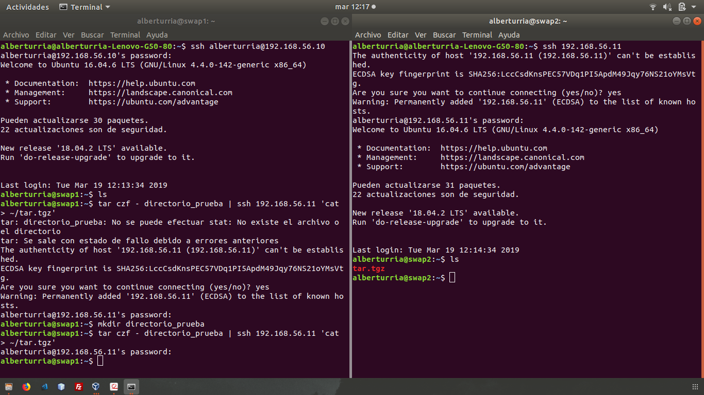
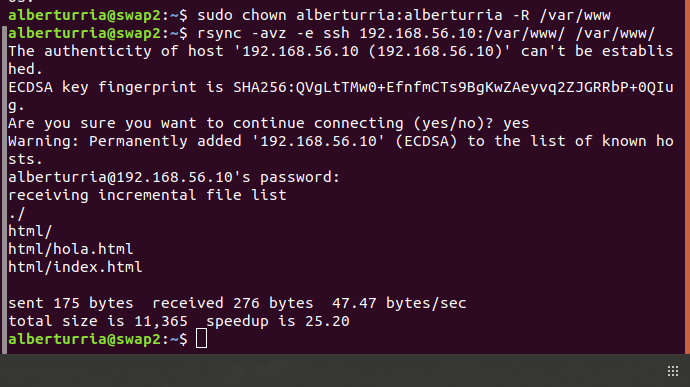
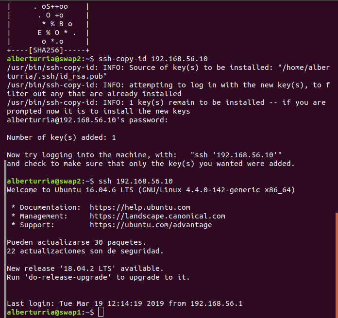
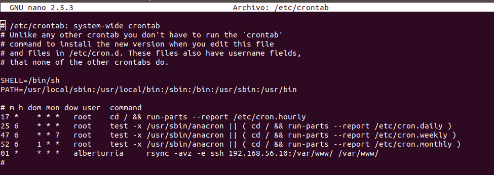

# Práctica 2

## ¿Qué hemos hecho?
El propósito de esta práctica ha sido el de trabajar con los comandos **rsync**, **ssh**, y programar tareas con **crontab**.

### Crear ficheros remotos
Para esta sección hemos creado un directorio llamado **directorio_prueba** en **swap1** y se ha enviado (comprimido) a **swap2**.

### rsync
En esta parte hemos realizado una sincronización del directorio **/var/www/** de la máquina **swap1** en **swap2**.

### ssh
En esta sección se ha facilitado la información necesaria para poder conectar dos máquinas de una misma red mediante ssh sin necesidad de introducir ninguna clave.
Esto es interesante para la creación de scripts remotos, o por ejemplo, el uso de la herramienta **crontab**.

### Tareas con crontab
Finalmente, hemos hecho uso de **crontab** para poder realizar tareas periódicas.
En este caso hemos realizado una sincronización del directorio **/var/www/** entre las máquinas **swap1** y **swap2**.

