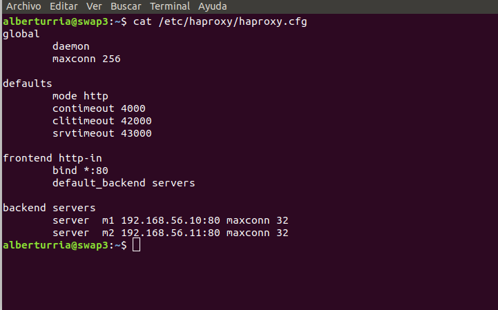
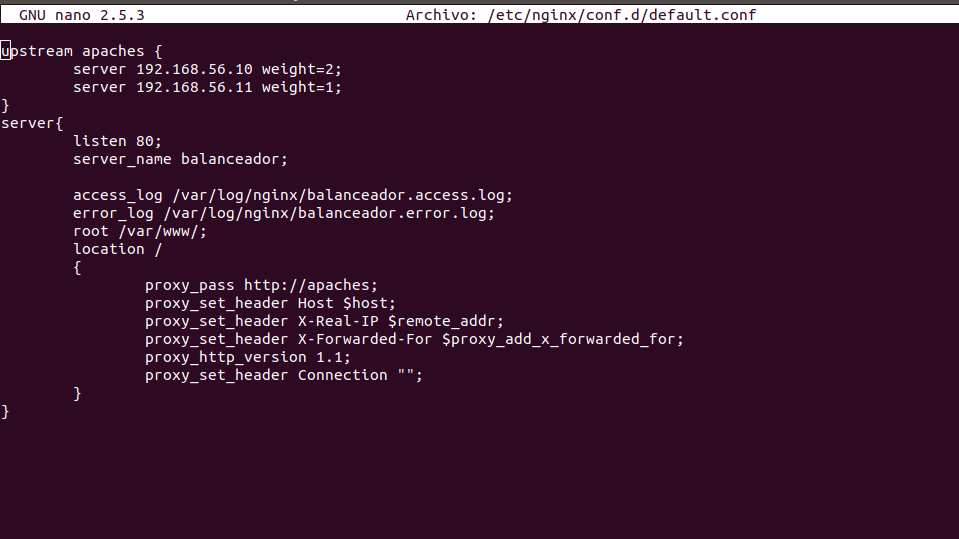

# Práctica 3

## ¿Qué hemos hecho?

Para esta práctica hemos configurado una nueva máquina, llamada *swap3* para que nos sirva como **balanceador de carga** para los otros dos servidores (*swap1* y *swap2*).

Cabe destacar que esta tercera máquina (*swap3*) no debemos de tener instalado ningún servidor http, ya que al éste hacer uso del puerto 80 de nuestra máquina, no podremos instalar un servicio balanceador de carga en el mismo puerto.

### Servidor web nginx

Como primera alternativa para balanceo de carga software, se nos propone usar **nginx**, éste es un servidor web que nos proporciona algunas utilidades para usarlo como balanceador.
para instalarlo hemos seguido las siguientes instrucciones:
```
sudo apt-get update && sudo apt-get dist-upgrade && sudo apt-get
autoremove
sudo apt-get install nginx
sudo systemctl start nginx
```

**IMPORTANTE**: Debemos de no tener instalado ningún servidor web, ya que si lo tenemos, no podremos finalizar la instalación (Ya que hay otros servicios que hacen uso del mismo puerto).

Para configurar el balanceo de carga del servidor web, haremos uso del fichero `/etc/nginx/conf.d/default.conf`.

Aquí podemos ver la configuración que hemos empleado.


En este ejemplo se emplea una configuración de round-robin, es decir, el balanceador va sirviendo alternativamente el `index.html` de las direcciones
```
192.168.56.10
192.168.56.11
```

Para poder distinguirlas, hemos modificado dicho fichero.
Aquí se puede apreciar.


Además hemos creado una nueva página llamada `prueba.html`, y aquí podemos ver como efectivamente nginx actúa como balanceador de carga:


### Servidor web haproxy

Como segunda alternativa hemos usado **haproxy** para balancear la carga de nuestros dos servidores web.
Para instalarlo hemos tenido que primero deterner el servidor *nginx* mediante el siguiente comando:
`sudo systemctl stop nginx`
y posteriormente ejecutar su instalación con:
```
sudo apt-get install haproxy
```

Para configurar dicho balanceador debemos de modificar el fichero `/etc/haproxy/haproxy.cfg`.
Este es el resultado de dicha configuración:




Como podemos ver, nuestro balanceador de carga funciona correctamente:


### Tarea

Para poder asignar el doble de capacidad a un servidor frente a otro, en nginx usaremos la directiva `weight=x`. De la siguiente forma:




Finalmente para someter al balanceador a altas cargas usaremos *ApacheBenchmark* para lanzar peticiones a nuestro  servidor.
Emplearemos la siguiente directiva:
```
ab -n 70000 -c 10 http://192.168.56.12/prueba.html
```

Los resultados con nginx son:


Y con haproxy:


Por tanto finalizamos con diciendo que *haproxy* es un poco mejor ya que para la misma carga de peticiones nos agiliza unos 6 segundos la ejecución.