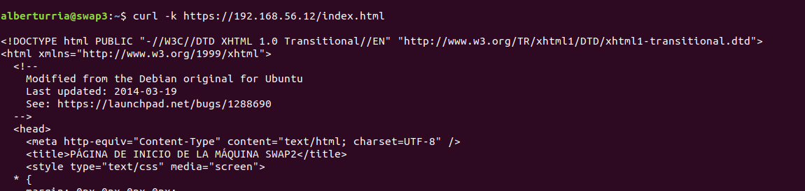
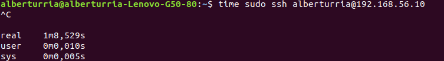

# Práctica 4

## ¿Qué hemos hecho?
El propósito de esta práctica ha sido el de poder firmar un **certificado electrónico** para que nuestro servidor sea capaz de resolver peticiones https.
Además hemos experimentado con **iptables** para configurar un cortafuegos en nuestra máquina.

### Instalar un certificado autofirmado
Para instalar el certificado hemos activado el módulo **ssl** de apache con *aenmod*.


Para generarlo debemos de escribir:
```
openssl req -x509 -nodes -days 365 -newkey rsa:2048 -keyout
/etc/apache2/ssl/apache.key -out /etc/apache2/ssl/apache.crt

```


Una vez creado el certificado, modificamos el archivo 
```
nano /etc/apache2/sites-available/default-ssl
```


Tras esto debemos de activar el default ssl y reiniciar apache.


Una vez realizado todo esto, procedemos a compartir el certificado a todas las máquinas.
Esto se realiza para que el balanceador pueda responder a las peticiones https que le realicen.

Una vez compartidos, procedemos a editar el archivo `default.conf` del balanceador nginx.


Como podemos apreciar, nuestro balanceador responde a peticiones https




### Configuración del cortafuegos

En esta parte hemos hecho uso de la herramienta iptables en el balanceador de carga.
Para ello hemos hecho uso de un script llamado `iptables.sh`.


Como se puede apreciar, el primero grupo de reglas, eliminan las reglas establecidas.
En el segundo grupo de reglas, se bloquea el acceso desde cualquier equipo.
En este caso, para comprobarlo, intentamos acceder por ssh y esto es lo que obtuvimos.



Los cuatro siguientes bloques de reglas permiten la conexión desde localhost, acceso por ssh, peticiones al puerto 80 y peticiones al puerto 443 respectivamente.

Para comprobarlo hemos ejecutado `netstat -tulpn` para ver qué puertos se encontraban en escucha.


Y para finalizar, hemos intentado automatizar el proceso de ejecución del archivo con el uso de `crontab -e`. Aquí se puede ver el resultado tras haberlo creado.


