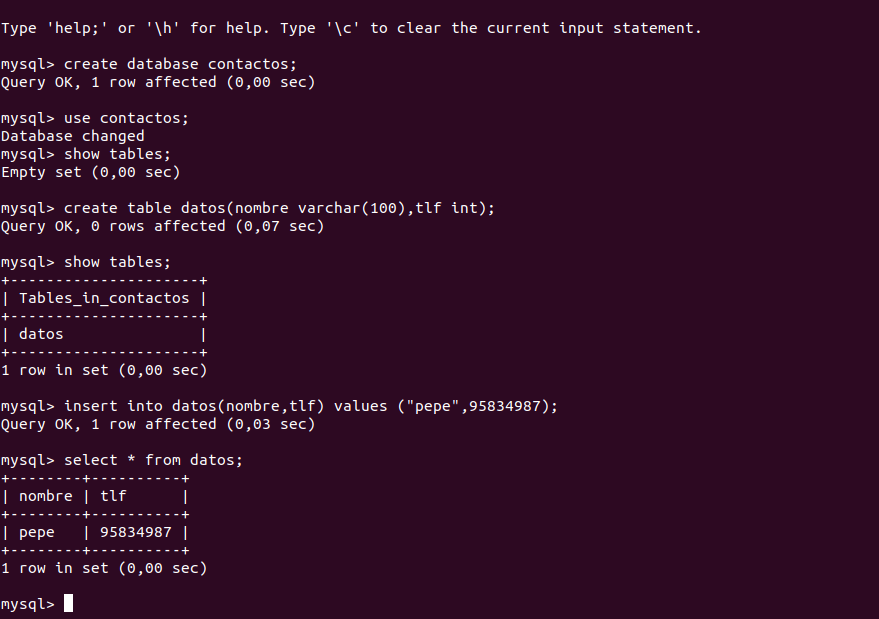
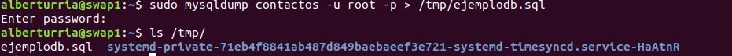
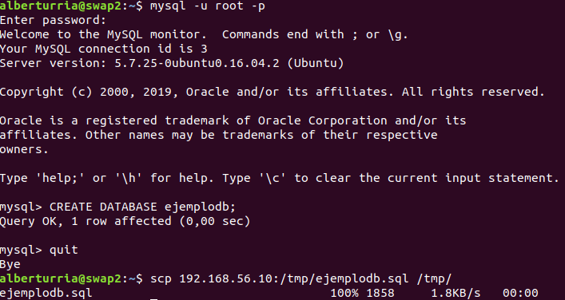
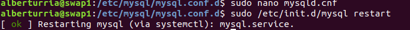
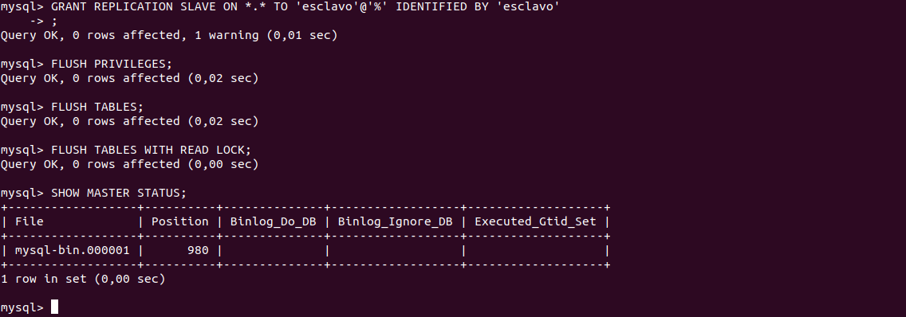
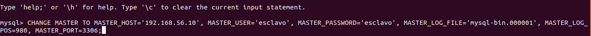
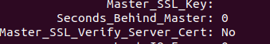
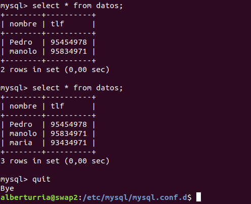

# Práctica 5

## ¿Qué hemos hecho?
El objetivo de esta práctica ha sido trabajar y familiarizarnos con el uso de bases de datos MySQL.
Además trabajaremos con configuraciones maestro-esclavo para que nuestra base de datos se encuentre actualizada en diferentes servidores.

### Crear una base de datos e insertar datos

Para crear una base de datos tan solo debemos de entrar a nuestro gestor de bases de datos  `mysql -u root -p`.

Un vez dentro, debemos de crear la base de datos con: `create database contactos;`.
Usar la base de datos: `use contactos;`.
Crear una tabla: `create table datos(nombre varchar(100),tlf int)`;
Y  comenzar a insertar datos: `insert into datos(nombre,tlf) values ("pepe",95834987);`.

### Replicación de Base de Datos

Para poder hacer una copia de la base de datos, podemos usar el comando que nos ofrece MySQL llamado `mysqldump`.
Este comando nos ofrece hacer un volcado de una de nuestras bases de datos a un fichero de extensión .sql.

Debemos de tener en cuenta que previo al volcado debemos de bloquear las tablas, ya que contienen información sensible a cambios, y un cambio durante el proceso de volcado nos haría tener un fichero inconsistente con el sistema.
Por ello debemos de ejecutar `FLUSH TABLES WITH READ LOCK;`.

Aquí podemos apreciar cómo se ha realizado el proceso de volcado.

Tras este proceso debemos de desbloquear las tablas de nuestra máquina principal con `UNLOCK TABLES;`.

En nuestra máquina secundaria podremos ahora, descargar el fichero de volcado para poder realizar una copia de nuestra base de datos.
Para ello es necesario previamente la realización de una base de datos con el mismo nombre que en la máquina principal.

Como se puede apreciar, hemos de hacer uso del comando `scp` para descargar el fichero de otra dirección IP.

### Configuración maestro-esclavo automática

Lo primero que se debe de hacer es realizar un cambio en la configuración del maestro. Más precisamente en el archivo `/etc/mysql/mysql.conf.d/mysqld.cnf`.
Debemos de comentar la línea `#bind-address 127.0.0.1`, identificar al servidor `server-id = 1`.
Tras esto hay que reiniciar el servicio mysql.

Tras ello, en la máquina maestro debemos de ejecutar las siguientes sentencias:
`mysql> CREATE USER esclavo IDENTIFIED BY 'esclavo';`
`mysql> GRANT REPLICATION SLAVE ON *.* TO 'esclavo'@'%' IDENTIFIED BY 'esclavo';`
`mysql> FLUSH PRIVILEGES;`
`mysql> FLUSH TABLES;`
`mysql> FLUSH TABLES WITH READ LOCK;`
`mysql> SHOW MASTER STATUS;`

Tras ello, obtenemos la siguiente salida:

Después de esto, y en la máquina esclava, debemos de ejecutar el siguiente comando:

Tras realizar un `UNLOCK TABLES;` en el maestro, ejecutaremos `SHOW SLAVE STATUS\G` y tendremos que fijarnos en la línea que dice `Seconds_Behind_Master`, que deberá indicar 0 si todo ha ido bien.

Aquí podemos comprobarlo:

Tras esto, tan solo queda comprobar que todo ha ido bien, insertando datos desde el maestro, y viendo si el esclavo actualiza la información.

En la siguiente captura vemos dos `select` seguidos desde la máquina esclava, donde se puede apreciar perfectamente cómo ha actualizado la información del maestro.

