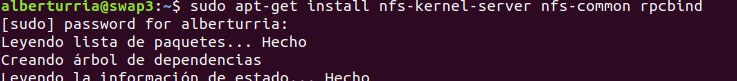
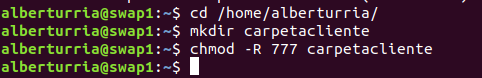
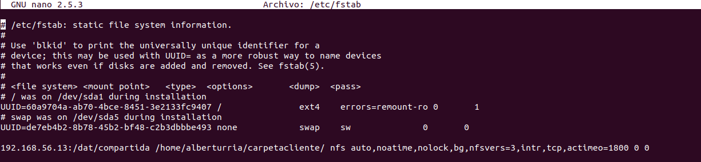

# Práctica 4

## ¿Qué hemos hecho?

En esta práctica se ha intentado trabajar con NFS, haciendo que un servidor se encargase de exportar una carpeta mediante NFS a todos sus clientes.

### Configurar servidor

Para comenzar debemos de instalar las herramientas que vamos a utilizar:

Tras esto creamos la carpeta que deseamos compartir y le damos los permisos necesarios:

Tras esto debemos de editar el fichero `/etc/exports` para dar permisos de lectura y escritura a los clientes.

`/dat/compartida/ 192.168.56.11(rw) 192.168.56.12(rw)`

Una vez realizado esto, tan solo quedará reiniciar el servicio en el servidor:
`sudo service nfs-kernel-server restart`

### Configurar cliente

Debemos de instalar los paquetes que vamos a usar y crear el punto de monaje:

Tras esto ya tenemos el sistema funcionando.
Tan solo quedaría modificar el archivo fstab para que no se desconfigure cada vez que el sistema se reinicia.
Para ello hemos de escribir lo siguiente en el archivo `/etc/fstab`:

### Configuración maestro-esclavo automática

Lo primero que se debe de hacer es realizar un cambio en la configuración del maestro. Más precisamente en el archivo `/etc/mysql/mysql.conf.d/mysqld.cnf`.
Debemos de comentar la línea `#bind-address 127.0.0.1`, identificar al servidor `server-id = 1`.
Tras esto hay que reiniciar el servicio mysql.

Tras ello, en la máquina maestro debemos de ejecutar las siguientes sentencias:
`mysql> CREATE USER esclavo IDENTIFIED BY 'esclavo';`
`mysql> GRANT REPLICATION SLAVE ON *.* TO 'esclavo'@'%' IDENTIFIED BY 'esclavo';`
`mysql> FLUSH PRIVILEGES;`
`mysql> FLUSH TABLES;`
`mysql> FLUSH TABLES WITH READ LOCK;`
`mysql> SHOW MASTER STATUS;`

Tras ello, obtenemos la siguiente salida:

Después de esto, y en la máquina esclava, debemos de ejecutar el siguiente comando:

Tras realizar un `UNLOCK TABLES;` en el maestro, ejecutaremos `SHOW SLAVE STATUS\G` y tendremos que fijarnos en la línea que dice `Seconds_Behind_Master`, que deberá indicar 0 si todo ha ido bien.

Aquí podemos comprobarlo:

Tras esto, tan solo queda comprobar que todo ha ido bien, insertando datos desde el maestro, y viendo si el esclavo actualiza la información.

En la siguiente captura vemos dos `select` seguidos desde la máquina esclava, donde se puede apreciar perfectamente cómo ha actualizado la información del maestro.

